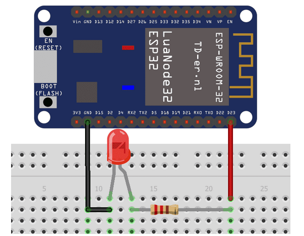

# 🔘 Projet ESP32 - Commande à distance (LED & Buzzer)

## Objectif

Créer une interface web permettant de **contrôler une LED et un buzzer** connectés à une ESP32 via des boutons sur une page web.

---

## Étape 1 : Ajout des boutons dans `data.php`

Modifier le fichier :

```bash
/var/www/html/btsciel/data.php
```

### Code à ajouter dans `<body>`

```html
<h1>Commande ESP32</h1>

<button onclick="fetch('http://IP_ESP32/son')">
Allumer
</button>

<button onclick="fetch('http://IP_ESP32/led')">
Allumer
</button>
```

---

### Résultat attendu

* Un bouton **Allumer** → active le buzzer
* Un bouton **Allumer** → contrôle la LED
* Interaction via requêtes HTTP envoyées à l’ESP32

---

## Étape 2 : Ajout des actionneurs sur l’ESP32

### Matériel nécessaire

* ESP32
* Grove Buzzer
* LED
* Résistance **220 Ω**
* Breadboard

---

## 🔊 1. Test Buzzer

### Branchement

* VCC → 3.3V
* GND → GND
* SIG → GPIO 26

### Code Arduino

```cpp
const int buzzer = 23;

void setup() {
  ledcAttach(buzzer, 2000, 8);
}

void loop() {
  ledcWriteTone(buzzer, 262); // Do
  delay(300);

  ledcWriteTone(buzzer, 294); // Ré
  delay(300);

  ledcWriteTone(buzzer, 330); // Mi
  delay(300);

  ledcWriteTone(buzzer, 0); // stop
  delay(1000);
}
```

### Résultat attendu

Le buzzer joue une séquence de notes (Do, Ré, Mi).

---

## 💡 2. LED

### Branchement


* LED connectée sur **GPIO 23**
* Résistance : **220 Ω**
---

### Code Arduino

```cpp
const int led = 23;

void setup() {
  pinMode(led, OUTPUT);
}

void loop() {
  digitalWrite(led, HIGH); // allumer
  delay(2000);

  digitalWrite(led, LOW); // éteindre
  delay(2000);
}
```

---

### Résultat attendu

* LED s’allume pendant 2 secondes
* Puis s’éteint pendant 2 secondes

---

## Validation

* Tester les boutons depuis la page web
* Vérifier le fonctionnement du buzzer et de la LED
* Faire valider le montage par le professeur

---

## Remarques

* Vérifier que l’ESP32 est accessible via son IP
* S’assurer que le serveur web et l’ESP32 sont sur le même réseau
* Adapter les broches GPIO si nécessaire

---
## Étape 3 : Contrôle de la LED et du Buzzer via une page web

### Objectif

Permettre de **contrôler une LED et un buzzer à distance** depuis une page web en utilisant des requêtes HTTP.

---

## Code ESP32

⚠️ Modifier les identifiants WiFi avant utilisation

```cpp
#include <WiFi.h>
#include <WebServer.h>

const char* ssid = "VOTRE_WIFI";
const char* password = "VOTRE_MDP";

WebServer server(80);

int sortieled = 23;
int buzzer = 26;

int channel = 0;
int resolution = 8;

void handleLED() {
  digitalWrite(sortieled, HIGH);
  delay(1000);
  digitalWrite(sortieled, LOW);

  server.send(200, "text/plain", "LED allumée");
}

void handleSON() {
  ledcWriteTone(channel, 1000);
  delay(300);
  ledcWriteTone(channel, 500);
  delay(300);
  ledcWriteTone(channel, 0);

  server.send(200, "text/plain", "Son joué");
}

void setup() {
  Serial.begin(115200);

  pinMode(sortieled, OUTPUT);

  ledcSetup(channel, 2000, resolution);
  ledcAttachPin(buzzer, channel);

  WiFi.begin(ssid, password);

  while (WiFi.status() != WL_CONNECTED) {
    delay(500);
  }

  Serial.println(WiFi.localIP());

  server.on("/led", handleLED);
  server.on("/son", handleSON);

  server.begin();
}

void loop() {
  server.handleClient();
}
```

---

## Fonctionnement

| URL    | Action           |
| ------ | ---------------- |
| `/led` | Allume la LED    |
| `/son` | Active le buzzer |

---

## Rôle de `server.on("/led", handleLED);`

Cette ligne permet d’associer une **route HTTP** à une fonction.

➡️ Quand on accède à :

```
http://IP_ESP32/led
```

➡️ La fonction `handleLED()` est exécutée.

---

## Rôle de `server.send(200, "text/plain", "Son test");`

Cette instruction envoie une réponse HTTP :

* **200** : code de succès
* **text/plain** : type de contenu
* **"Son test"** : message retourné

➡️ Le navigateur affiche ce message après la requête.

---

## Résultat attendu

* Bouton web → envoie une requête à l’ESP32
* ESP32 → exécute l’action (LED ou buzzer)
* Retour d’un message HTTP

---

## ⚠️ Remarques

* L’ESP32 doit être sur le même réseau que le serveur
* Vérifier l’adresse IP affichée dans le moniteur série
* Les `delay()` bloquent temporairement le serveur

---

